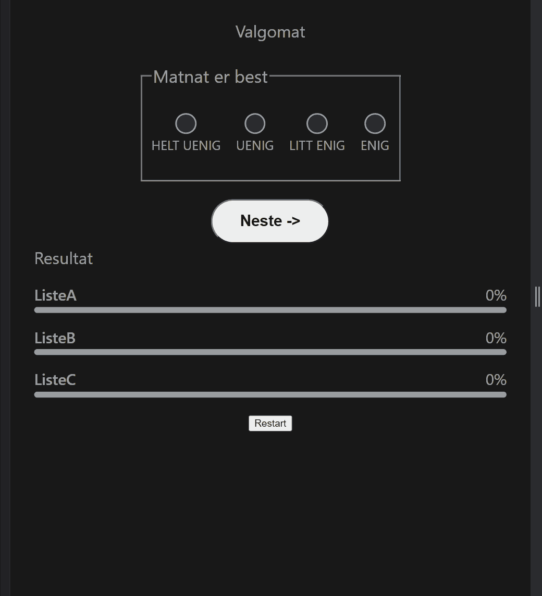

# Studentparlamentet Valgomat

Enkel valgomat for studenparlamentet på UiB laget av friByte.

## Grunnlag

Studentparlamentet på UiB ønsker å utvikle en valgomat for å øke interessen rundt studentvalget som foregår hvert år.

Valgomaten er basert på NRK valgomat sin matematikk som ligger åpen tilgjengelig på Github https://github.com/nrkno/valg-valgomat-algoritme. For å lese mer om hvordan NRK har implementert sin valgomat se https://nrkbeta.no/2019/07/03/slik-snekret-vi-en-valgomat-for-hele-landet/.

## Krav

- [x] Infoboks om valgomaten
- [x] Kunne deploye valgomaten inni for eksempel en wordpress side
- [x] Lett kunne bytte ut spørsmål og svar på valgomaten neste år
- [x] Vise en lett oversikt over hvor enig man er med hver liste
- [x] Fungere med keyboard
- [x] Støtte flere ulike påstander hvert år som bestemmes med url parameter
- [ ] Støtte for å definere url hvor påstander skal hentes fra istedenfor å måtte bygge koden på nytt hvert år man har nye påstander

## Deploy ny versjon:

1. Legg inn csv fil med påstander i `/src/data/` mappen på samme form som `fiktive-statements.csv`:

```CSV
Spørsmål;Beskrivelse;ListeA;ListeB
UiB er best;Saken dreier seg om den evige krigen mellom UiB og HVL;-2;2
Bergen er best;Trenger ingen forklaring;1;2
```

- Hvor første kolonne inneholder spørsmål, andre inneholder en lengre beskrivelse av saken og resten av kolonnene inneholder hvor enig eller uenig hver liste er på en skala fra -2 til 2.

2. Rediger `/src/App.vue` og importer den nye csv filen på liknende vis som de andre. Og legg den til en case i switch operasjonen slik at om url parameteren er for eksempel `2023lister` så vil den nye csv filen bli brukt.
3. Bygg vue prosjektet (Dette gjøres i dag automatisk i GitHub actions)
4. Deploy prosjektet til https://valgomat.fribyte.no (dette må i dag gjøres manuelt. Ved å slette containeren som kjører på pengebingen hos friByte, kjøre `docker pull fribyte/valgomat:latest` -> starte container igjen med env variabler som trengs.) `sudo docker pull fribyte/valgomat:latest; sudo docker rm -f valgomat; sudo docker run --detach --name valgomat --env "VIRTUAL_PORT=3000" --env "VIRTUAL_HOST=valgomat.fribyte.no" --env "LETSENCRYPT_HOST=valgomat.fribyte.no" fribyte/valgomat:latest`

## Integrer valgomat i en nettside

Integrer https://valgomat.fribyte.no?pastander=2023lister som en iframe i nettsider som skal vise valgomaten med følgende kode:

```HTML
<iframe src="https://valgomat.fribyte.no?pastander=2023lister&tema=studvest" height="600px" />
```

- Det som står bak `?pastander=` er en url parameter som bestemmer hvilke påstander som skal vises i valgomaten.

Følgende påstander eksisterer så langt, flere kommer med tiden:

```
2022lister
2023lister
```

- Legger du til `&tema=studvest` i url vil du få en mer nøytral bakgrunn istedenfor studentparlamentet sin oransje farge.
- Vi anbefaler minimum 600px høyde, bredde settes automatisk til full bredde, men kan og defineres selv med for eksempel `width="90%"`.

## Lage nytt tema

Legger man til `&tema=NAVN-PÅ-TEMA` i url, vil `App.vue` automatisk bytte til andre css farger og bakgrunn. For å lage et nytt tema legger du til en ny case i switch operasjonen i `App.vue` under `themeCSS` og legger til css verdier som passer til ditt tema.

## Demo (utdatert)



## Utvikling

### Tekniske krav

- Nodejs https://nodejs.org/en/

### Hvordan utvikle lokalt

1. Innstaller node modules: `npm install`
2. Kjør utviklingskommando: `npm run dev`

### Type-Check, Compile and Minify for Production

```sh
npm run build
```

### Run Unit Tests with [Vitest](https://vitest.dev/)

```sh
npm run test
```

### Lint with [ESLint](https://eslint.org/)

```sh
npm run lint
```

## Recommended IDE Setup

[VSCode](https://code.visualstudio.com/) + [Volar](https://marketplace.visualstudio.com/items?itemName=johnsoncodehk.volar) (and disable Vetur) + [TypeScript Vue Plugin (Volar)](https://marketplace.visualstudio.com/items?itemName=johnsoncodehk.vscode-typescript-vue-plugin).

## Type Support for `.vue` Imports in TS

TypeScript cannot handle type information for `.vue` imports by default, so we replace the `tsc` CLI with `vue-tsc` for type checking. In editors, we need [TypeScript Vue Plugin (Volar)](https://marketplace.visualstudio.com/items?itemName=johnsoncodehk.vscode-typescript-vue-plugin) to make the TypeScript language service aware of `.vue` types.

## Customize configuration

See [Vite Configuration Reference](https://vitejs.dev/config/).
